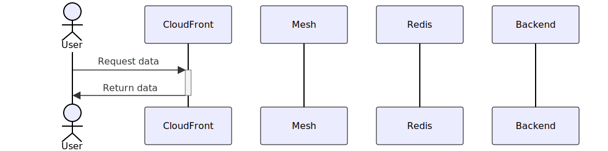
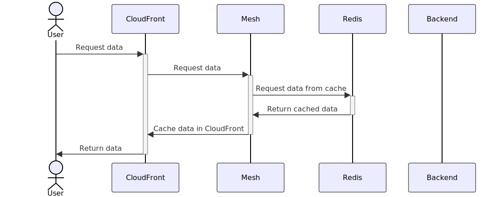
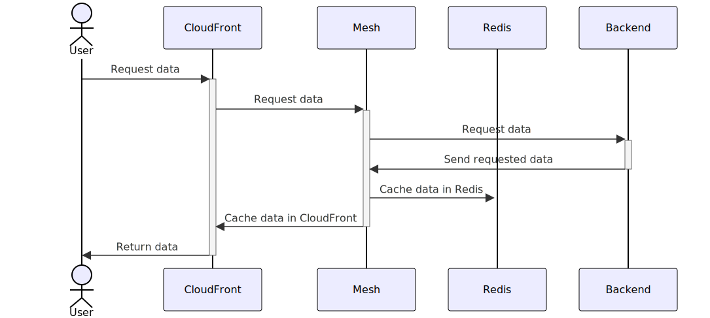

# Cache within the Mesh

## Why do we cache?

There are quite a few reasons we might want to cache data. Some of the common reasons are:

1. Reduce load on the backend
2. Reduce latency for users

These are both valid reasons to cache for the mesh too. However, the other vital reason we cache is to avoid rate limiting by third party endpoints. BigCommerce for example is very aggressive with rate limiting, meaning if we send too many requests the entire mesh service will go down. By caching, we ensure there is a reduced load hitting third party endpoints.

## What should we cache?

Anything we can! We should be quite aggressive with our caching. Any query that returns the same data for all users can easily be cached at all cache layers (examples being: store config, countries, products, etc). However queries that return different data per user (examples: profile information) cannot be cached at the CloudFront layer, they need to be cached at the application layer.

When caching a query it's important to first determine what the cache can vary on. It can help to think of cache varying as an additional cache data store with a different key.

By default this is how cache keys work, a single key has a single value:

| Key       | Value               |
| --------- | ------------------- |
| countries | {"au": "Australia"} |

This works well for something like countries. AU is always going to be equal to Australia. But what happens if we want to get the current user's country? We can't use this same method anymore.

| Key     | Value     |
| ------- | --------- |
| country | Australia |

If this is what we cache a user who logs in from any country will always get Australia! You can get around this in the mesh application cache layer by adding a suffix to the key. In this case we could use the user id to vary:

| Key       | Value       |
| --------- | ----------- |
| country-1 | Australia   |
| country-2 | New Zealand |
| country-3 | Australia   |

This will now work as expected. However we can see that even if the values are the same for two users we need to store it multiple times. This is something to be aware of, we don't want our vary keys to be too niche. Otherwise we end up storing a lot of information that we might not even use.

When we need custom cache keys it becomes much harder to store this cache at the edge layer (almost impossible). See [CloudFront](#cloudfront) for more information on why this is the case.

It's impossible to cache mutations but we can potentially cache _parts_ of a mutation. As an example lets say we have a mutation to add a product to the cart. In this hypothetical mutation we need to first get additional information about the product before adding it to the cart. To perform an add to cart action we would need to make two requests: one that gets the additional product information and one that adds the product to the cart. We can't cache the mutation but we can cache the additional product information!

## Cache layers

There are currently two layers of cache in the mesh: edge location cache (CloudFront), and application cache (Redis).

Users will first hit the CloudFront cache layer. If no cache is found it will hit the mesh service. The mesh service will then check Redis for existing cache. If not found it will request it from the backend and then save it in Redis cache.

### When data is cached in CloudFront:

### When data is cached in Redis

### When data is not cached

### CloudFront

CloudFront is the first layer of cache for mesh. This cache is stored across AWS edge locations. This not only reduces load on our mesh servers, but also reduces latency by serving content from servers that are close to the end user. See this [AWS developer guide](https://docs.aws.amazon.com/AmazonCloudFront/latest/DeveloperGuide/cache-hit-ratio-explained.html) for more information on how caching works with edge locations.

Queries to be stored in cache at this level are defined in the `cache.ts` file under the backend's src directory (e.g. [packages/mesh/bigcommerce/src/cache.ts](../packages/mesh/bigcommerce/src/cache.ts)). Operations are simply the specific operation to cache and their TTL. This layer of cache cannot vary on anything. Meaning if cache is defined here, the stored cache must be applicable to all users.

One of the big downsides of this cache method is clearing the cache. CloudFront doesn't have a way to clear cache for a single query, the only option we have is to clear all the GraphQL cache. This is due to how CloudFront cache invalidation works. You can only invalidate cache based on path. And as all GraphQL queries happen at the `/graphql` path, all of the cache will be cleared when invalidating.

**CloudFront cache should be used for queries that return the same data for all users.** CloudFront cache should have a shorter TTL than application cache.

### Redis

Redis is our application cache layer. This means that all requests that hit our redis cache need to first travel through our servers. The primary goal of this cache is not to reduce our own server load (although it can be used for that, more detail later), but instead to reduce the load on third party endpoints. In turn, this also means we spend less time making network requests which decreases response time for users.

As this cache happens at the application layer, we have complete control over it. We can cache any piece of data in any format we like. We can interact with cache by using the built in methods on the `context.cache` object.

There is currently no easy way to clear this cache. In the future we can write modules to clear cache dynamically when it becomes out of date. E.g. if a product price changes we could have a trigger that talks to Redis and updates the cache for that specific product.

**Redis cache should be used for queries that return data dependant on context.** E.g. different data returned for different users. **If CloudFront cache is used, Redis cache should always be used.** Cache TTL should be as long as possible. This is especially true if a mechanism is in place to trigger a cache update.
